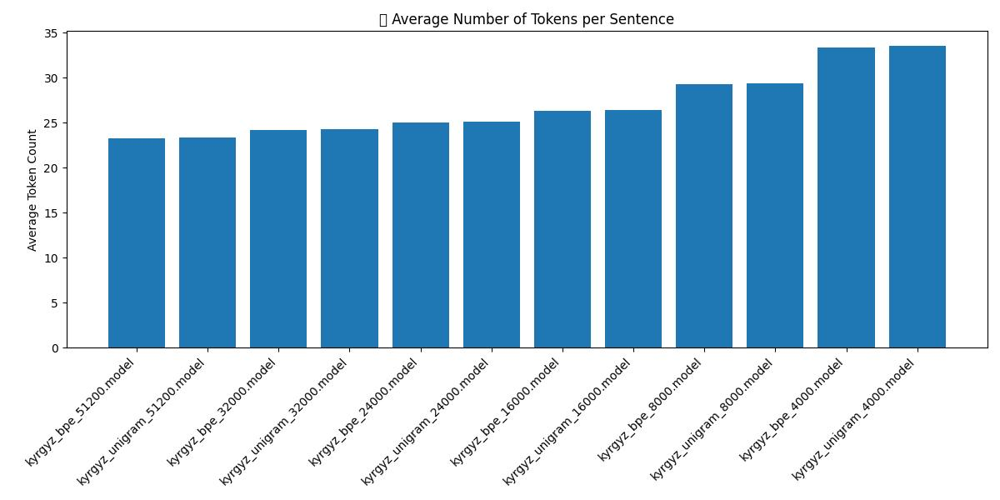

---
language:
- ky
license: MIT
tags:
- kyrgyz
- tokenization
- sentencepiece
- BPE
- Unigram
---

# Kyrgyz SentencePiece Tokenizers

**Introduction**  
This project provides pre-trained SentencePiece tokenizers for the Kyrgyz language. A *tokenizer* is a tool that splits text into smaller units called **tokens**. Tokenizing text helps convert words or sentences into pieces that a computer can more easily handle for language tasks (like text classification or machine translation). Even if the tokenizer encounters a word it hasn't seen before, it can break that word into known subword pieces, so the text can still be processed.

These tokenizers are trained on a large Kyrgyz corpus of about **1.5 million sentences** from news articles and Wikipedia. The training data was collected from the Leipzig Corpora Collection:  
🔗 [https://wortschatz.uni-leipzig.de/en/download/Kirghiz](https://wortschatz.uni-leipzig.de/en/download/Kirghiz)

Thanks to this extensive training data, the tokenizers have learned a wide range of words and patterns in Kyrgyz. This ensures that the vocabulary covers common Kyrgyz language usage, and even uncommon or new words can be represented by combining familiar pieces.


**Tokenizer Types (Algorithms)**  
We offer two types of tokenization algorithms, so you can choose what works best for you:
- **BPE (Byte-Pair Encoding)** – This algorithm builds the vocabulary by iteratively merging the most frequent sequences of characters. In simple terms, it starts from individual letters and repeatedly joins together letter combinations that appear often, eventually forming whole words or common subwords.
- **Unigram** – This algorithm starts with a large list of potential subword pieces and gradually removes the ones that are least useful. It keeps the pieces that best explain the text. In practice, Unigram finds an optimal set of tokens based on their likelihood in the training data.

Both BPE and Unigram ultimately produce a set of tokens that can split Kyrgyz text effectively. For most users, **both algorithms will work well**, and you can try either to see which fits your task better. If you're not sure, you might start with a BPE model.

**Vocabulary Size Options**  
Each tokenizer comes in multiple **vocabulary sizes** (number of tokens). We provide models with vocabularies of **4,000**, **8,000**, **16,000**, or **32,000** tokens. The vocabulary size is essentially how many unique subword units the tokenizer knows:
- A *larger vocabulary* (e.g., 32,000) means the tokenizer knows more distinct tokens (including many whole words). This usually allows it to represent text in fewer tokens since it can keep words intact if they were in its vocab. However, a larger vocab model file is slightly bigger and might generalize a bit less to very rare or new words.
- A *smaller vocabulary* (e.g., 4,000) means the tokenizer knows fewer tokens. This will break words into smaller pieces more often, resulting in more tokens per sentence. The model file is a bit smaller and it may handle unknown words by breaking them down more since it has fewer whole words stored.

There's a trade-off: larger vocabularies mean fewer tokens (longer pieces), and smaller vocabularies mean more tokens (shorter pieces). In practice, **8,000 or 16,000** are good middle-ground choices for many applications. If unsure, you can start with the **BPE 16,000** model for a balance between detail and generalization.

## Available Models

Below is a list of all available tokenizer models in this project. Each model has a `.model` file (the binary SentencePiece model) and a corresponding `.vocab` file (a text list of the tokens). You only need the `.model` file to use the tokenizer in code (the `.vocab` is for reference).

| Model Name           | Algorithm (Type) | Vocab Size |
| -------------------- | ---------------- | ---------- |
| kyrgyz_bpe_4000      | BPE             | 4000       |
| kyrgyz_bpe_8000      | BPE             | 8000       |
| kyrgyz_bpe_16000     | BPE             | 16000      |
| kyrgyz_bpe_32000     | BPE             | 32000      |
| kyrgyz_bpe_51200     | BPE             | 51200      |
| kyrgyz_unigram_4000  | Unigram         | 4000       |
| kyrgyz_unigram_8000  | Unigram         | 8000       |
| kyrgyz_unigram_16000 | Unigram         | 16000      |
| kyrgyz_unigram_32000 | Unigram         | 32000      |
| kyrgyz_unigram_51200 | Unigram         | 51200      |



*(Each model above consists of a `.model` and `.vocab` pair with the given name.)*

## Usage

Using these tokenizers is simple. Here are the steps to get started:

1. **Select a model** – Decide which tokenizer you want to use (BPE or Unigram, and the vocabulary size). For example, you might choose the **`kyrgyz_bpe_8000`** model.
2. **Download the model files** – Get the `.model` (and optionally `.vocab`) file for the model you chose. If you're using the Hugging Face Hub, you can download the file from the repository. If you have the project files, the models are located in the `models/` directory.
3. **Install SentencePiece** – Make sure you have the SentencePiece library installed in your environment. You can install it via pip:  
   ```bash
   pip install sentencepiece
4. Load and use the tokenizer – Use the SentencePiece Python API to load the model and tokenize text. Below is an example:
   ```python
   import sentencepiece as spm

   # Load the SentencePiece model
   sp = spm.SentencePieceProcessor(model_file="kyrgyz_bpe_4000.model")

   # Example Kyrgyz text to tokenize
   text = "Салам, дүйнө!"

   # Encode the text into tokens (subwords)
   tokens = sp.encode(text, out_type=str)
   print("Tokens:", tokens)
   # Tokens (str): ['▁', 'С', 'ал', 'ам', ',', '▁дүйнө', '!']

   tokens_id = sp.encode(text, out_type=int)
   print("Токены (ID):", tokens_id)
   # Tokens (ID): [3930, 1, 27, 69, 7, 991, 8]

   # You can also decode tokens back to the original text
   decoded_text = sp.decode(tokens)
   print("Decoded:", decoded_text)
   # Decoded: Салам, дүйнө!

   # Note: In the token output above, the special symbol "▁" at the beginning of some tokens represents a space character. For example, "▁дүйнө" indicates that there was a space before "дүйнө" in the original text. With the tokenizer loaded, you can now integrate it into your NLP pipeline. You might use it to preprocess text for a language model or any other Kyrgyz language processing task. Simply feed your Kyrgyz sentences to sp.encode() to get tokenized input for your models.

License

This project is open source under the MIT License. You are free to use, modify, and distribute these tokenizers in your own projects.